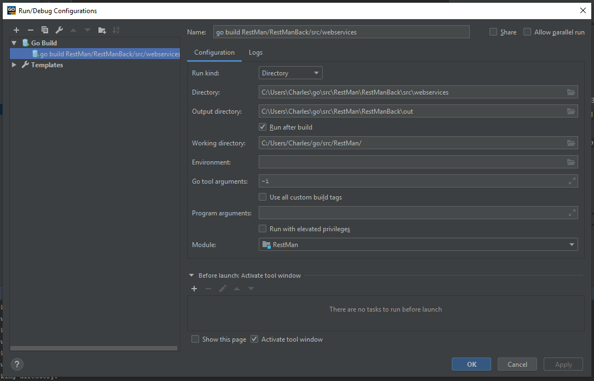

# RestMan - Back

  

Backend part of a project made for Licence Pro GL (_3rd year University_)  

### _Prerequisites:_

 - Golang : [1.11.15](https://golang.org/)
 - You need to check that you have `$GOROOT` in your environement variable
 - a directory in `:/user/go/src`

***

### _Run using only the CMD:_
 - Open a cmd and go to you directory `:/user/go/src`
     * if you have a C driver : `cd C:/user/go/src`
 - clone the project :
     * `git clone https://github.com/CharlesLgn/RestMan.git`
 - go in the back part :
     * `cd ./RestMan/RestManBack`
 - add all library using :
     * `go get github.com/ant0ine/go-json-rest/rest` 
     * `go get -u github.com/gorilla/mux`
 - build all :
     * `go build -i -o ./RestMan/RestManBack\out\RestManBack.exe ./RestMan/RestManBack/src/webservices/`
 - run project :
    * `./RestMan/RestManBack/out/RestManBack.exe`

***

### _Run using an IDE:_
 - install goland
     * [intall](https://www.jetbrains.com/go/)
 - Open a cmd and go to you directory `:/user/go/src`
     * if you have a C driver : `cd C:/user/go/src`
 - clone the project :
     * `git clone https://github.com/CharlesLgn/RestMan.git`
 * add all library using :
     - `go get github.com/ant0ine/go-json-rest/rest`
     - `go get -u github.com/gorilla/mux`

 - open the project on goland
 - create your configuration :  
     
 - run the project

***
***

### _Run the Front:_  
  

