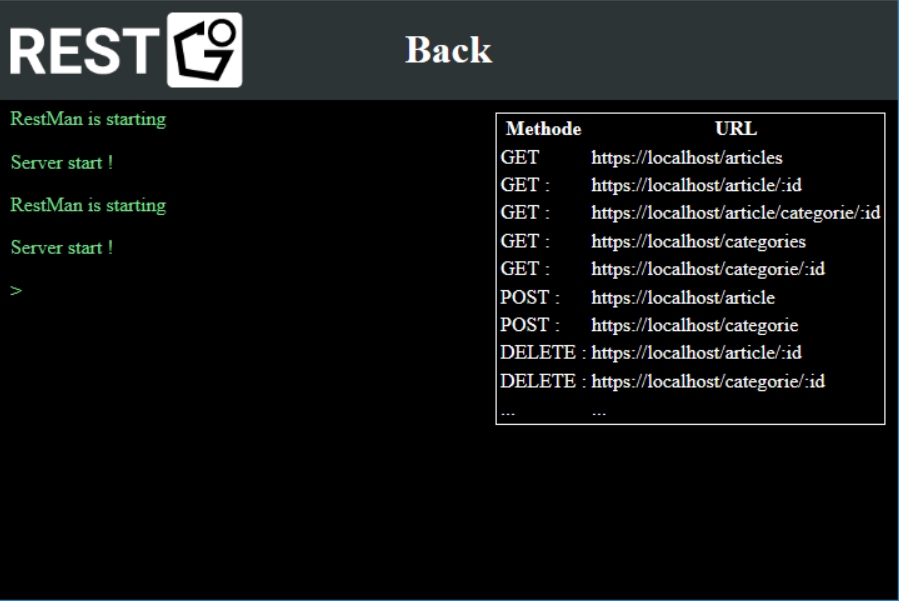

# RestGo - Difficulties  
[](https://www.linkedin.com/in/charles-ligony-893177134/)
[](https://www.linkedin.com/in/cyril-challouatte-824021160/)  
[]()

Project made for Licence Pro GL (_3rd year University_)  
It use the Framework Front Flutter developped by Google

***
### OUTLINE
 1. [Dificulties in the Front](./README.md#dificulties-in-the-front-)  
 2. [Dificulties in the Back](./README.md#dificulties-in-the-back-)  
 	2.1. [What is Go ?](./README.md#what-is-go-)  
	2.2. [Make a Rest-API in Go](./README.md#make-a-rest-api-in-go)  
	2.3. [Particalarity of Golang Structure type](./README.md#particalarity-of-golang-structure-type)  
	2.4. [Why there is no database connection ?](./README.md#why-there-is-no-database-connection-)  
	2.5. [Graphic interface in Go](./README.md#graphic-interface-in-go)  
	2.6. [Resume](./README.md#resume)  
	
***
### _Dificulties in the Front :_

***
### _Dificulties in the Back :_
#### What is Go ?
Golang is a low level language like C. When you compile Go (`go build`) it create a binary executable. But to be more powerfull than C, the langage need library.  
Infact there is nothing native in Go. it exist some basic library implemented in Go source code (like `net/http` or `image/gif`) but re rest is made by our own.
Fortunatly Golang has a very good idea. there is inside go a versionning and build tool used to get lib direcly from the net using git. so if you need librarie on gitub or bitbucket, you have just to call this lib via `go get url_of_the_lib`

#### Make a Rest-API in Go
the rest API is powered by Gorilla mux which is a powerful URL router and dispatcher for golang.  
[]() 

Moreover we use an other library to make easy the restFul Json api : [go-json-rest](https://github.com/ant0ine/go-json-rest)

So the dificulty was to learn how thes lib can be use and how can we call them

#### Particalarity of Golang Structure type
Go is think to make http server, so the langage is made to make also easy the readin of a `JSON` or a `XML`  
For instace I have a car with an id, a name, a color and a price :
```Go
package exemple

type Car struct {
  Id     int
  Name   string
  Color  string
  Price  float64
}
```
So to parse these data in a json you just have to made :  
```Go
package exemple

type Car struct {
  Id     int     `json:"id"`
  Name   string  `json:"name"`
  Color  string  `json:"color"`
  Price  float64 `json:"price"`
}
```

And the thing very interesting is : if you want to code in french for instance but you want you json in english you can write :
```Go
package exemple

type Voiture struct {
  Id       int     `json:"id"`
  Nom      string  `json:"name"`
  Couleur  string  `json:"color"`
  Prix     float64 `json:"price"`
}
```

Golang will parse the data by itself. Moreover if you want Json and XML you can write :
```Go
package exemple

type Car struct {
  Id     int     `xml:"id,attr"   json:"id"`
	Name   string  `xml:"car>name"  json:"name"`
	Color  string  `xml:"car>color" json:"color"`
	Price  float64 `xml:"car>price" json:"price"`
}
```

There are four things you need to know and respect in RestAPI in Go :  
  1. To parse data with a XML or a Json, you need you data structure to be public  
      (__private__ method or variable : begin by a __lowerCase__)  
      (__public__  method or variable : begin by a __upperCase__)
  2. If you use a structure, data are parse automaticly  
      you can also use a `map[string]string` and look all data as string
  3. If you write nothing, in your option structure, it could not read file you send and will send empty files.  
  4. If you don't want to send an empty data you can add `omitempty` in your option structure

#### Why there is no database connection ?
We decide to not implement any database to make easier the deployment of RestGo Back version.
But we have looked for with a very inspiring [tuto](https://www.alexedwards.net/blog/practical-persistence-sql) and [the Golang 
doc](https://golang.org/pkg/database/sql/)
Maybe it will be done for a V2.0

We also decide to store data as long as the app in launched (because it is just an exemple and not a real api). so it is in hard in the code.

The only part not in hard is : the xml trad for the translator.


#### Graphic interface in Go
_(this is not the front for RestGo Front but a little terminal GUI for the back to run it just on the .exe click)_

There is no graphic framework in Go. So we need to find something to make graphics and thre is two option :
  - make a graphic interface from scratch
  - use a graphic library and find out a solution.

We decide to use a [webview library](https://github.com/zserge/webview) and write a front in `html`

It was one of the most dificult part because there is no tutorial to make it.  
So what happen when you run it :
  - It run the localhost app
  - It display a little screen that write all the log
  - If you close it, the server are closed.

[]()

#### Resume

<table>
  <tr>
    <th>n°</th><th>Name</th>        <th>type</th>         <th>Dificulty</th>
  </tr><tr>
    <th>1</th> <th>Gorrilla mux</th><th>learn the API</th><th>★☆☆☆☆</th>
  </tr><tr>
    <th>2</th><th>go-json-rest</th> <th>learn the API</th><th>★☆☆☆☆</th>
  </tr><tr>
    <th>3</th><th>Golang structure type</th><th>learn langage particularity</th><th>★★★☆☆</th>
  </tr><tr>
    <th>4</th><th>Golang private/public definition</th><th>learn langage particularity</th><th>★★★★☆</th>
  </tr><tr>
    <th>5</th><th>GUI</th><th>Learn how to make graphic from Go</th><th>★★★★★</th>
  </tr>

</table>


***

## Run the Front:  [](https://github.com/CharlesLgn/RestGo/blob/master/RestManFront/README.md)  

## Run the Back:   [](https://github.com/CharlesLgn/RestGo/blob/master/RestGoBack/README.md)
